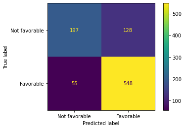

# NFL-BETTING-PROJECT
## OVERVIEW
This project involved creating a model that can predict if the favored team will win their NFL game. The Calm Before the Score was founded to help degenrate NFL gamblers make an educated decision each weekend. Padawan John, an NFL gambler, has contacted us to help him generate more money by creating a model to predict the winner. In order to create a model we used a data frame from kaggle which included information from every NFL game from 1966 to 2022. We narrowed down the data frame, and analyzed over 9,000 games. We looked into their spreads, favored team, score, and weather. Aftewards, we created a couple of predictive models, and chose the best one, an XG Boost model. Which provided us with an accuracy score of 80%, which mean't the favored team was more likey to win, but not always. 
## Buisness Problem 
We were hired by an NFL gambling addict, Padawan John.  He wants us to create a model that well help predict if the favored NFL team will win their game that week. Which at the end, will generate him more money. 
## Data Understanding 
The data set that was used to create our models came from Kaggle. Which included data gathered from the NFL, ESPN, and Pro Football Reference. The data contain over 13,000 games from 1966 - 2022,  that contained variables regarding the game. The variables included were: score, spread, temperature, wind, humidity, stadium, favorite team, and many more. Our main focus was to have a high accuracy score, as well as, a high true positive. To process all the information, and complete our objective, we ran with the XG Boost model. The reason being, it gave us the highest accuracy score compare to the rest. 
## Methods 
Before we ran any of our models, we had to first clean up the data. To do so, we dropped pesky null values, focused on the years 1985-2022, and dropped data from the superbowl. We also coverted a categorical column to numerical, as well as, created new columns such as, avgerage spread of home team and average temp. of home team. After cleaning the data up we ended with about 9000 games compare to the 13,000 games. We focused on the weather, score, speard, and favorite team. We ran a couple of baseline models to see which was going to provide the best accuracy score. At the end, we went with the XG Boost model. 
## Results 

Our XG Boost model provided an accuracy score of 80%. Which was the main objective as we could look into the true negative and true positive to make bets. Thus, our model does an outstanding job in predicting the winner, but that won't always be the case. 
## Next Step
If we were to have more time we would clean up our data even more, so it could be more accurate. As well as add more data regarding, power rankings, future seasons, and player injuries. And also, refine our model and parameters, so we can get a higher accuracy score. And at the end generate Padawan John more income with safer bets.